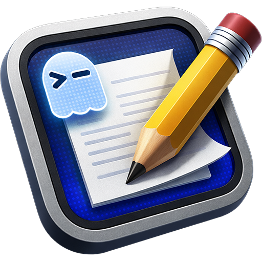

<p align="center">
  
</p>

<h1 align="center">Ghostgen</h1>

<p align="center">
  A native macOS GUI for configuring the <a href="https://ghostty.org">Ghostty</a> terminal emulator.
</p>

<p align="center">
  <a href="https://github.com/nmindz/ghostgen/releases">Releases</a> &middot;
  <a href="https://ghostty.org">Ghostty</a> &middot;
  <a href="https://github.com/zerebos/ghostty-config">Original Inspiration</a>
</p>

---

## About

Ghostgen gives you a visual interface for editing your Ghostty terminal configuration (`~/.config/ghostty/config`). No more hand-editing key-value files — tweak colors, fonts, keybinds, and 320+ settings through a native macOS app that reads and writes your config directly.

This project is an unofficial tool and is not affiliated with Ghostty.

## Features

- **Settings Editor** — 320+ Ghostty settings organized across 10 categories: Application, Clipboard, Window, Colors, Fonts, Keybinds, Mouse, GTK, Linux, macOS
- **Save & Persistence** — loads your existing config on launch, tracks unsaved changes, saves with `Cmd+S`
- **Theme Studio** — create, edit, import, and export Ghostty themes with a live terminal preview and 22-color editor
- **Font Playground** — preview fonts at different sizes, weights, and styles in a realistic terminal mockup
- **Import / Export** — share your config via file or clipboard, with a preview before importing
- **Backup & Restore** — create timestamped snapshots of your config before experimenting, restore any backup with one click
- **Native macOS** — overlay titlebar, traffic light positioning, `.app` bundle

## Requirements

- macOS 12.0+
- [Node.js](https://nodejs.org) 20+
- [Rust](https://rustup.rs) (stable toolchain)
- [Ghostty](https://ghostty.org) (the terminal emulator you're configuring)

## Getting Started

```bash
# clone the repo
git clone https://github.com/nmindz/ghostgen.git
cd ghostgen

# install dependencies
make deps

# start dev server with hot reload
make dev
```

## Build & Install

```bash
# build release and install to /Applications
make install

# or just build without installing
make release
```

The built app lands in `src-tauri/target/release/bundle/macos/Ghostgen.app`.

## Development

| Command         | Description                              |
|-----------------|------------------------------------------|
| `make dev`      | Start dev server with hot reload         |
| `make build`    | Build debug (frontend + Tauri)           |
| `make release`  | Build optimized release                  |
| `make install`  | Build release and install to /Applications |
| `make deps`     | Install npm dependencies                 |
| `make check`    | TypeScript type check                    |
| `make clippy`   | Run clippy on Rust code                  |
| `make fmt`      | Format Rust code                         |
| `make lint`     | Run all linting (check + clippy)         |
| `make clean`    | Remove build artifacts                   |
| `make help`     | Show all available commands              |

## Tech Stack

| Layer     | Technology                                |
|-----------|-------------------------------------------|
| Frontend  | React 18, TypeScript, TailwindCSS v4, Zustand, React Router |
| Backend   | Rust, Tauri v2                            |
| Build     | Vite, Cargo                               |
| Package   | npm                                       |

## Project Structure

```
ghostgen/
  src/                    # React frontend
    components/           # UI components (settings, views, layout)
    stores/               # Zustand stores (config, toasts)
    data/                 # Settings schema (320+ settings)
    utils/                # Config parsing, color utilities
  src-tauri/              # Rust backend
    src/commands/          # Tauri commands (config, backup, themes)
```

## How It Works

Ghostgen reads and writes directly to `~/.config/ghostty/config`, the standard Ghostty configuration file. On launch, it parses your existing config and populates the UI. When you save, it writes only the settings that differ from Ghostty's defaults.

**Themes** are saved to `~/.config/ghostty/themes/` as standard Ghostty theme files (22-line key-value format). Any theme you create in the Theme Studio is immediately available to Ghostty via `theme = Your Theme Name` in your config.

**Backups** are stored in `~/.config/ghostgen/backups/` as timestamped copies of your config file. They persist even if you uninstall Ghostgen.

## Credits

Ghostgen is inspired by [ghostty-config](https://github.com/zerebos/ghostty-config) by [Zerebos](https://github.com/zerebos), a web-based Ghostty configuration tool built with SvelteKit. The settings schema, color previews, and theme fetching approach were adapted from that project.

## License

Ghostgen is free software licensed under the [GNU General Public License v3.0](LICENSE) or later.

This program is distributed in the hope that it will be useful, but WITHOUT ANY WARRANTY; without even the implied warranty of MERCHANTABILITY or FITNESS FOR A PARTICULAR PURPOSE. See the [LICENSE](LICENSE) file for details.
